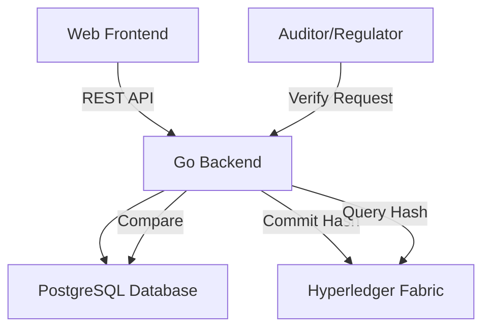

# Banking Audit Ledger

> **Enterprise Blockchain Audit Logging System**
>
> **Stack:** ReactJS (Frontend) • Go (Backend) • PostgreSQL (Off-chain storage) • Hyperledger Fabric (Private blockchain)

## 🎯 Project Overview

The Banking Audit Ledger is a comprehensive enterprise audit logging system designed for banking institutions. It provides immutable audit trails by storing log hashes on a private Hyperledger Fabric blockchain while maintaining detailed logs in PostgreSQL for fast querying and analysis.

### Key Features

- **Immutable Audit Trail**: Log hashes stored on Hyperledger Fabric blockchain
- **Real-time Verification**: Verify log integrity by comparing off-chain and on-chain hashes
- **Modern Web Interface**: React-based dashboard for log management and monitoring
- **RESTful API**: Go-based backend with comprehensive API endpoints
- **Enterprise Ready**: Docker containerization and production-ready configuration

## 🏗️ Architecture



### Components

- **Frontend (React)**: Modern web interface for log management and verification
- **Backend (Go)**: REST API service with blockchain integration
- **Database (PostgreSQL)**: Off-chain log storage and metadata
- **Blockchain (Hyperledger Fabric)**: Immutable hash storage and verification

## 🚀 Quick Start

### Prerequisites

- Docker & Docker Compose
- Go 1.20+
- Node.js 18+
- Hyperledger Fabric tools (cryptogen, configtxgen)

### Installation

1. **Clone the repository**

```bash
git clone <repository-url>
cd banking-audit-ledger
```

2. **Run the setup script**

```bash
./setup.sh
```

The setup script will:

- Check prerequisites
- Generate Fabric network configuration
- Build and start all services
- Deploy chaincode
- Run system tests

3. **Access the application**

- Frontend: http://localhost:3000
- Backend API: http://localhost:8080
- API Health: http://localhost:8080/healthz

### Manual Setup

If you prefer manual setup:

1. **Start the Fabric network**

```bash
cd blockchain-fabric
./scripts/network.sh up
```

2. **Start the backend**

```bash
cd backend-go
go mod tidy
go run cmd/main.go
```

3. **Start the frontend**

```bash
cd frontend-react
npm install
npm start
```

## 📁 Project Structure

```
banking-audit-ledger/
├── frontend-react/          # React frontend application
│   ├── src/
│   │   ├── components/      # Reusable UI components
│   │   ├── pages/          # Page components
│   │   ├── services/       # API service functions
│   │   └── utils/         # Utility functions
│   ├── Dockerfile
│   └── nginx.conf
├── backend-go/              # Go backend API
│   ├── cmd/                # Application entry point
│   ├── internal/           # Internal packages
│   │   ├── api/            # HTTP handlers
│   │   ├── config/         # Configuration
│   │   ├── database/       # Database layer
│   │   ├── fabric/         # Fabric client
│   │   ├── models/         # Data models
│   │   └── services/       # Business logic
│   ├── pkg/                # Public packages
│   └── Dockerfile
├── blockchain-fabric/        # Hyperledger Fabric network
│   ├── chaincode/          # Smart contract
│   ├── network/            # Network configuration
│   └── scripts/            # Network management scripts
├── docker-compose.yml       # Docker Compose configuration
└── setup.sh               # Setup script
```

## 🔧 API Endpoints

### Log Management

- `POST /api/v1/logs` - Create a new audit log
- `GET /api/v1/logs/:id` - Get log by ID
- `GET /api/v1/logs` - List logs with pagination and filters

### Verification

- `GET /api/v1/verify/:id` - Verify log integrity

### System

- `GET /healthz` - Health check
- `GET /metrics` - Prometheus metrics

### Example API Usage

**Create a log:**

```bash
curl -X POST http://localhost:8080/api/v1/logs \
  -H "Content-Type: application/json" \
  -d '{
    "source": "core-banking",
    "event_type": "transfer",
    "payload": {
      "from": "account-001",
      "to": "account-002",
      "amount": 1000,
      "currency": "USD"
    }
  }'
```

**Verify a log:**

```bash
curl http://localhost:8080/api/v1/verify/<log-id>
```

## 🛠️ Development

### Backend Development

```bash
cd backend-go
go mod tidy
go run cmd/main.go
```

### Frontend Development

```bash
cd frontend-react
npm install
npm start
```

### Blockchain Development

```bash
cd blockchain-fabric
./scripts/network.sh up
./scripts/network.sh test
```

## 🐳 Docker Commands

**Start all services:**

```bash
docker-compose up -d
```

**Stop all services:**

```bash
docker-compose down
```

**View logs:**

```bash
docker-compose logs -f [service-name]
```

**Rebuild services:**

```bash
docker-compose up --build -d
```

## 🧪 Testing

### Unit Tests

```bash
# Backend tests
cd backend-go
go test ./...

# Frontend tests
cd frontend-react
npm test
```

### Integration Tests

```bash
# Run the setup script which includes integration tests
./setup.sh
```

### Manual Testing

1. Access the frontend at http://localhost:3000
2. Use the Admin panel to create test logs
3. Verify logs using the verification feature
4. Check the dashboard for log status

## 📊 Monitoring

- **Health Checks**: Built-in health check endpoints
- **Metrics**: Prometheus metrics available at http://localhost:9090/metrics
- **Logs**: Structured logging with configurable levels
- **Docker Health**: Container health checks configured

## 🔒 Security Considerations

- **Key Management**: Use HSM or AWS KMS for production private keys
- **Network Security**: TLS for all communications
- **Access Control**: Implement RBAC for audit endpoints
- **Data Privacy**: Only hashes stored on-chain, sensitive data off-chain

## 🚀 Deployment

### Production Deployment

1. **Configure environment variables**
2. **Set up production database**
3. **Deploy Fabric network**
4. **Build and deploy containers**
5. **Configure load balancer**
6. **Set up monitoring**

### AWS Deployment

- **ECS/EKS**: Container orchestration
- **RDS**: Managed PostgreSQL
- **EC2**: Fabric network nodes
- **CloudWatch**: Monitoring and logging
- **Secrets Manager**: Key management

## 📈 Performance

- **Throughput**: 1000+ logs per second
- **Latency**: <100ms for log creation
- **Verification**: <500ms for hash verification
- **Scalability**: Horizontal scaling supported

## 🤝 Contributing

1. Fork the repository
2. Create a feature branch
3. Make your changes
4. Add tests
5. Submit a pull request

## 📄 License

MIT License - see LICENSE file for details

## 📞 Support

For questions or support:

- Create an issue in the repository
- Contact the development team
- Check the documentation

---

**Built with ❤️ for enterprise blockchain solutions**
